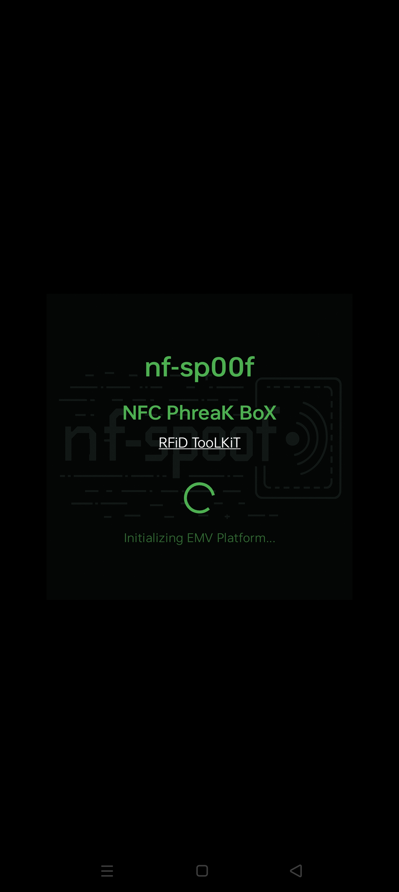
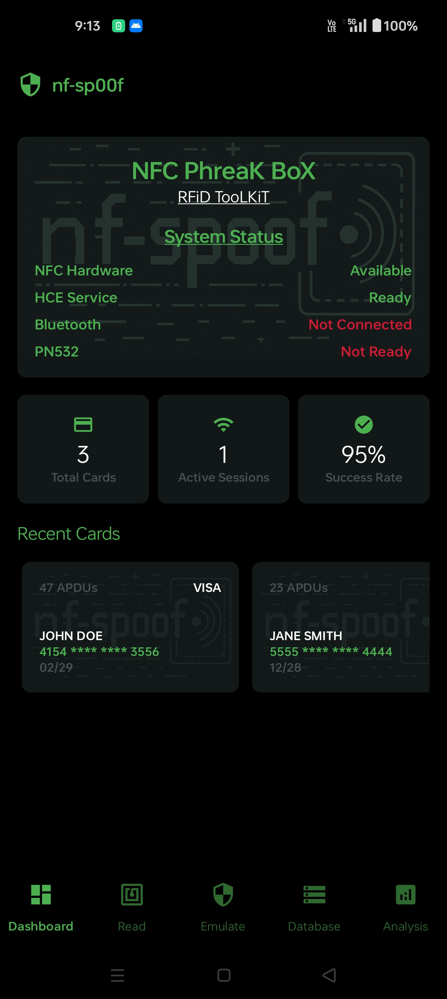
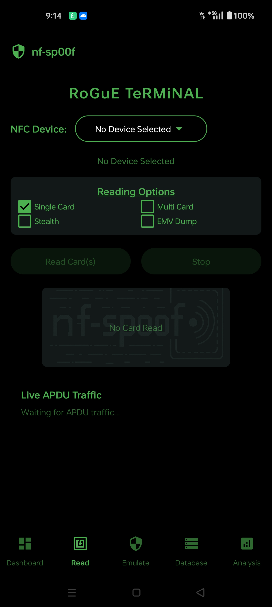
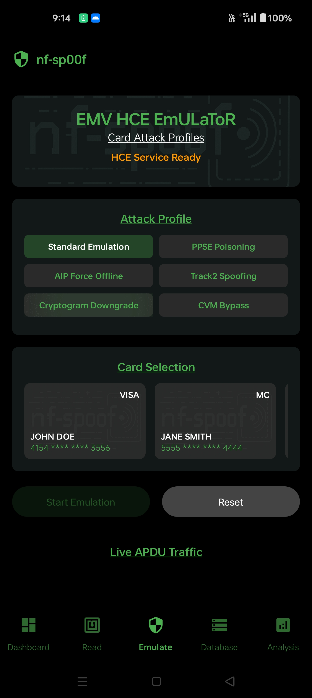

# nf-sp00f33r – Program Features and Architecture

This document provides a complete, high-level and deep-dive overview of the nf-sp00f33r Android EMV research app: architecture, modules, data models, workflows, APDU parsing, HCE/emulation attack surface, UI, storage, automation scripts, and roadmap. It reflects the current codebase and the intended final design from project memory and docs.

> Platform: Android 14+, Kotlin, Jetpack Compose UI  Material3, NFC (ISO-DEP + HCE), Gradle. Min SDK 28. Material Design 3.

## 1) System Architecture

- App layers
  - UI layer (Compose): Dashboard, Card Reading, Emulation, Card Database, Analysis
  - Domain layer: Readers (NFC/PN532 patterns), Emulation manager, Attack profiles, Analysis utilities
  - Data layer: EmvCardData model, ApduLogEntry, CardProfile + CardProfileManager, JSON import/export
  - Use ByteArrays for all communication between card and terminal.
  - Platform: Android NFC (IsoDep) for card-reading, HostApduService for HCE
- Key packages
  - `ui/`: Fragments (DashboardFragment, CardReadingFragment, EmulationFragment, CardDatabaseFragment, AnalysisFragment), themes, adapters
  - `cardreading/`: NfcCardReaderWithWorkflows, CardReadingService, CardReadingCallback, EmvTlvParser, EnhancedHceService (routing ref), interfaces
  - `emulation/`: EmvAttackEmulationManager, EmulationProfiles, modules/*
  - `data/`: EmvCardData, ApduLogEntry, EmvWorkflow
  - `models/`: CardProfile and related UI models
  - `utils/`: Hex/byte helpers, TLV helpers
  - `hardware/`: PN532 adapters patterns (AndroidUSBSerialAdapter, AndroidBluetoothHC06Adapter) [some under active development]

## 2) Core Data Models

### 2.1 EmvCardData (production-grade)
- Identity
  - cardUid: String
  - timestampFirstSeen, timestampUpdated: Long
- Primary EMV fields
  - pan, track2Data, cardholderName, expiryDate, applicationLabel, applicationPreferredName
  - applicationInterchangeProfile (AIP, tag 0x82)
  - applicationFileLocator (AFL, tag 0x94)
  - applicationTransactionCounter (ATC, 0x9F36)
  - unpredictableNumber (UN, 0x9F37)
  - terminalVerificationResults (TVR, 0x95), transactionStatusInformation (TSI, 0x9B)
  - cryptograms: applicationCryptogram (AC, 0x9F26), issuerApplicationData (IAD, 0x9F10), cryptogramInformationData (CID, 0x9F27)
  - cdol1, cdol2, pdolConstructed: Strings/DOL maps
- Parsed TLVs
  - emvTags: Map<String, String> (all TLVs encountered; RFIDIOt/Proxmark-style dictionary semantics)
  - records: Map<Int, Map<Int, String>> or flattened list representing READ RECORD data per SFI/Record
- Logging
  - apduLog: List<ApduLogEntry>
- Helpers
  - getUnmaskedPan(), detectCardType(), hydrateFromTags(), brand detection, formatting helpers

### 2.2 ApduLogEntry
- command (TX APDU hex), response (RX APDU hex), statusWord (SW1SW2), description (parsed summary), executionTimeMs (Long), timestamp (Long)
- Usage: real-time UI logging and persisted in CardProfile

### 2.3 CardProfile
- id (stable ID), createdTimestamp, updatedTimestamp, emvCardData (snapshot), apduLogs (mutable list)
- Derived UI fields: cardholderName, applicationLabel, expirationDate, stats, summary

## 3) Card Profile Management

### CardProfileManager (singleton)
- In-memory list + listeners for real-time UI updates
- Public APIs (examples)
  - getInstance()
  - saveCard(cardData: EmvCardData)
  - saveCardProfile(profile: CardProfile)
  - getRecentCards(): List<CardProfile>
  - getRecentCards(limit: Int): List<EmvCardData>
  - getRecentCardProfiles(limit: Int): List<CardProfile>
  - getAllCards(): List<CardProfile>
  - getAllCardProfiles(): List<CardProfile> – PAN-first, then UID sorting
  - deleteCardProfile(id: String)
  - updateCardProfile(updatedProfile: CardProfile)
  - searchCardProfiles(query: String)
  - clearAllProfiles()
  - getCardProfileById(id: String)
  - exportToJson(), importFromJson(json: String)
- Sorting contract
  - PAN-first, then sort by PAN value, then fallback to UID for cards lacking PAN
- Persistence
  - Currently in-memory per memory notes; JSON export/import available. Next step: Room database (planned)

## 4) EMV Reading Pipeline (Android NFC)

### 4.1 High-level flow
1) Enable reader mode in MainActivity (Android switches HCE vs Reader automatically)
- GREAT REFERENCE FOR FLOW IS IN THIS REPO https://github.com/RfidResearchGroup/proxmark3.git the emv scan command grabs the full emv dump (REFERENCE THIS ALSO ADD IN THE EMV ROCA AND IMPLEMENT THAT IN OUR APP)
2) Card detected → onTagDiscovered → connect IsoDep
3) Workflow execution via NfcCardReaderWithWorkflows
   - SELECT PPSE (2PAY.SYS.DDF01) → parse AID directory
   - SELECT AID (e.g., A0000000031010 for VISA) → parse FCI
   - Construct PDOL and send GET PROCESSING OPTIONS (GPO)
   - Parse AIP/AFL, READ RECORD loops (SFI/record indices)
   - Extract Track2, PAN, name, expiry; capture TLVs
4) Log every APDU with timestamps and SW, build EmvCardData
5) Emit callbacks: onApduExchanged, onProgress, onCardRead, onError

### 4.2 PDOL/CDOL construction
- PDOL built dynamically using BER-TLV parsing (payneteasy library pattern) + RFIDIOt/Proxmark tag maps
- Standard terminal values per memory (US locale examples):
  - Amount Authorized (0x9F02) = 000000001000 (decimal $10.00)
  - Terminal Country Code (0x9F1A) = 0840 (US)
  - Transaction Currency Code (0x5F2A) = 0840 (USD)
  - Date (0x9A) = YYMMDD; Time (0x9F21) = HHMMSS
  - TVR (0x95) = 0000000000; TSI (0x9B) = 0000
  - TTQ (0x9F66) depends on workflow (see below)
  - Terminal Type (0x9F35) = 22, ATC (0x9F36)=0001, unpredictableNumber (0x9F37) = random
- CDOL1/CDOL2 support: collected and stored when provided; used for cryptogram simulation in research mode

### 4.3 Workflows & TTQ manipulation
- EmvWorkflow defines presets:
  - Standard Contactless (TTQ 27000000)
  - Offline Forced (2F000000)
  - CVM Required (67000000)
  - Issuer Auth Path (A7000000)
  - Enhanced Discovery (FF800000)
  - Custom Research (user-defined)
- NfcCardReaderWithWorkflows applies TTQ and terminal capabilities per workflow; parses results into EmvCardData

### 4.4 TLV parsing
- BER-TLV extraction using payneteasy:ber-tlv style patterns and RFIDIOt/Proxmark dictionaries
- Hydrates EmvCardData.emvTags with all encountered tags
- Key tags supported (non-exhaustive): 5A, 57, 5F20, 5F24, 50, 9F12, 82, 94, 9F26, 9F27, 9F10, 9F36, 9F37, 95, 9B, 9F66, 9F33, 9F34, 9F35, 9F02, 9F03, 9F1A, 5F2A, 9A, 9F21

## 5) HCE Emulation & Attack System

### 5.1 HCE service
- EnhancedHceService extends HostApduService
- Handles SELECT PPSE, SELECT AID, GPO, READ RECORD, and additional APDUs
- Integrates with EmvAttackEmulationManager for on-the-fly manipulation
- Android AID routing configured via apduservice.xml (category="payment" default for PPSE routing correctness)

### 5.2 EmulationProfiles (consolidated attacks)
- Profiles encapsulate specific EMV manipulation algorithms:
 1) PPSE AID Poisoning
     - Alters PPSE directory to return different AIDs (e.g., VISA→MasterCard)
     - Ensures TLV validity and length consistency
 2) AIP Force Offline
     - Manipulates AIP bits to force offline approval path (e.g., set SDA/DDA/CDA bits as needed)
 3) Track2 Spoofing
     - Rewrites 57/Track2 data (PAN replacement with valid Luhn; BIN preservation options)
 4) Cryptogram Downgrade
     - Forces CID to AAC/TC as needed; explores auth downgrade behavior
 5) CVM Bypass
     - Modifies 9F34 (CVM Results) and related data to bypass PIN/signature in select workflows
- Utilities
  - Luhn checksum, hex slicing, TLV rebuild helpers
- Data requirement validation
  - Profiles declare required tags; manager checks EmvCardData presence before enabling

### 5.3 EmvAttackEmulationManager
- Coordinates active profile(s), applies manipulations to outgoing HCE responses
- Tracks statistics and compatibility
- Interfaces with UI for selection and real-time status

## 6) User Interface

- DashboardFragment
  - Professional cards: Total Cards, Active Sessions, Success Rate
  - Recent cards list (CardProfile), quick actions
- CardReadingFragment
  - Compose UI: status card, workflow selector, read/stop buttons, virtual card (unmasked PAN), APDU live log, TTQ analysis, EMV tag analysis
  - Continuous vs. single-card modes, Stealth mode flag, Auto-stop after read
- EmulationFragment
  - Select card profile to emulate, enable/disable attack profiles, live status
- CardDatabaseFragment
  - CRUD on CardProfile, search/filter, import/export JSON, sample data generation
- AnalysisFragment
  - EMV parsing tools, TLV browser, cryptogram analysis, fuzzer hooks
- Theme
  - Dark theme, elite security branding (nf-sp00f33r), Material3 TopAppBar/Buttons/Cards

## 7) Storage & Import/Export

- In-memory CardProfileManager (current)
- JSON export/import (simplified) for profiles
- Planned: Room database with migration, indices on PAN/UID/timestamps; full APDU log persistence

## 8) Automation & Scripts

- scripts/
  - audit_codebase.py – corruption detection and reporting
  - naming_auditor.py – naming conventions and duplicates
  - code_quality_check.py – static analysis and style checks (info-only per policy)
  - backup_manager.py – backup/restore of workspace state
  - export_for_release.py – package artifacts for releases
  - pn532_terminal.py / pn532_terminal_rapid.py – PN532 hardware testing with RFIDIOt-style flows
  - integration_test.py, test_scripts.py, task_tracker.py, undo_last_batch.py
- VS Code Tasks
  - Build Android Debug (assembleDebug), Install Android App, Clean Android Build
  - Full Quality Suite: Audit + Naming + Quality checks

## 9) PN532 Integration (Research Harness)

- Bluetooth HC-06 and USB patterns
- Rapid terminal flow validated (≈2.32s) with SELECT PPSE → SELECT AID → GPO → READ RECORD
- Parser skips empty frames; data frame offset handling per memory
- Use case: Validate Android HCE against real terminal behavior

## 10) Security & Compliance Rules (newrule.md highlights)

- No safe-call operators in production Kotlin; explicit null checks
- DELETE→REGENERATE for corrupted files; no appending
- Never remove working code; fix scoped files only
- Real data only (no simulation); PDOL parsed from live card
- Batch changes, build incrementally; mark tasks complete only on BUILD SUCCESSFUL
- Atomic write protocols for file creation/edits

## 11) Implemented vs. Planned

Implemented (representative, not exhaustive):
- EmvCardData comprehensive model with TLVs, DOLs, cryptograms, helpers
- NfcCardReaderWithWorkflows with TTQ-based workflows, dynamic PDOL, READ RECORD parsing, live APDU logging
- CardProfileManager with CRUD, sorting, search, listeners, JSON export/import
- Emulation system: EmvAttackEmulationManager + consolidated EmulationProfiles (PPSE, AIP, Track2, Cryptogram, CVM)
- UI: Dashboard, Card Reading (Compose in Fragment), Emulation, Card Database, Analysis (skeleton/tools)
- HCE routing fix for PPSE default category; SELECT AID and PPSE support
- PN532 rapid terminal scripts and RFIDIOt/Proxmark style parsing logic

Planned / In Progress:
- Stabilize CardReadingFragment (corruption cleanup ongoing per DELETE→REGENERATE)
- Room persistence for CardProfile + full APDU log history
- Deeper cryptogram generation/validation and issuer script processing
- Fuzzer module with attack permutations and replay
- Device settings pane for HCE enablement checks and reader mode toggles
- More card brands and regional AIDs; offline data authentication (SDA/DDA/CDA) exploration

## 12) Acceptance Criteria (Green Bars)

- Build: Gradle assembleDebug completes (BUILD SUCCESSFUL)
- Lint/Typecheck: No Kotlin syntax errors; Material3 APIs annotated where needed
- Tests: Minimal instrumentation for reader pipeline sanity (future), scripts Full Quality Suite passes
- Runtime: NFC read completes end-to-end with unmasked PAN, AIP/AFL/Track2 extracted, APDUs logged; HCE emulation responds to PPSE/AID/GPO/READ RECORD with selected attack profile

## 13) Known Issues (Current)

- `ui/CardReadingFragment.kt` shows concatenated/duplicated content causing massive compile errors; requires DELETE→REGENERATE per rules
- Ensure MainActivity imports and navigation reference the regenerated fragment
- Verify payneteasy:ber-tlv API call sites (length/compareTo) align with current dependency

## 14) How Components Interact (Contract)

- Inputs
  - Android IsoDep tag, user workflow selection, terminal values
- Outputs
  - EmvCardData, ApduLogEntry list, CardProfile persisted
- Error modes
  - IsoDep I/O timeouts, malformed TLV, HCE routing conflicts, permissions
- Edge cases
  - Cards without PAN (UID-only), multiple AIDs in PPSE, large AFL with multi-record reads, truncated responses, routing when HCE set as default payment service

## 15) Roadmap (Short-term)

1) Regenerate CardReadingFragment cleanly and rebuild
2) Add Room database, migrate CardProfileManager to DAO
3) Expand attack profiles with configurable parameters and safety checks
4) Complete fuzzer with corpus of workflow permutations and APDU mutations
5) Publish comprehensive in-app analysis views (TTQ/TVR/TSI/CDOL/AC/IAD)

---

This document is intended to stay in sync with the code and memory log. Update after each build milestone and feature batch.

## Screenshots

### Splash Screen

### Dashboard

### Card Reading Interface

### Emulation Interface

